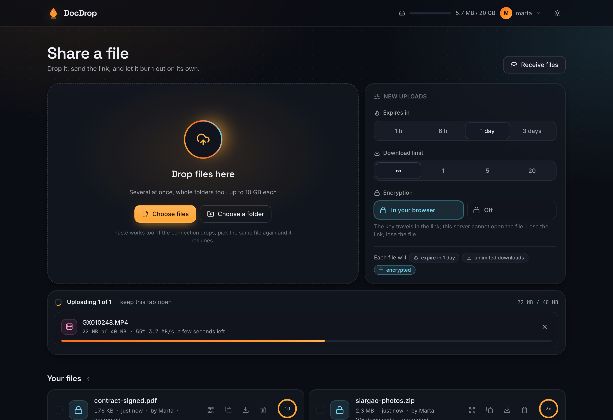
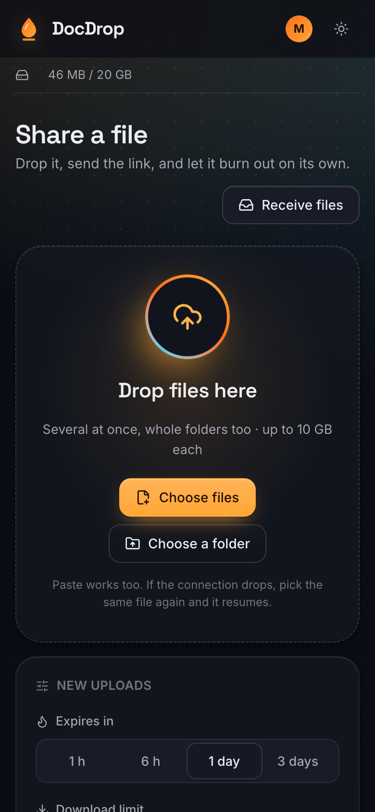
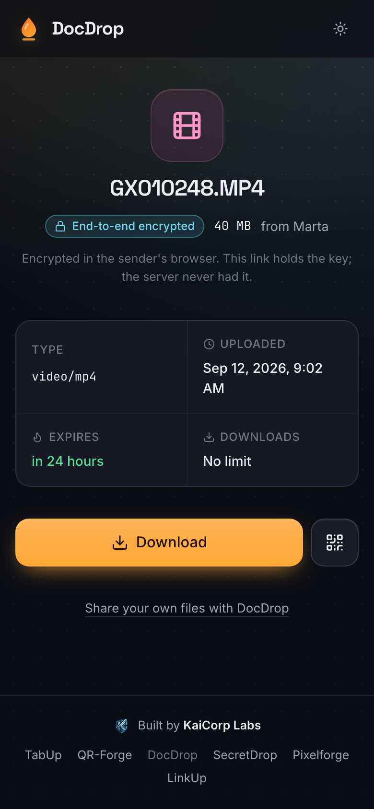

# DocDrop

[](https://github.com/Ulzuhan/docdrop/actions/workflows/ci.yml)
[](https://github.com/Ulzuhan/docdrop/pkgs/container/docdrop)
[](https://github.com/Ulzuhan/docdrop/releases)
[](LICENSE)

Self-hosted file sharing with expiring links. Someone uploads a file, shares the
link, and whoever wants it downloads it. The file deletes itself once it expires or
runs out of downloads.

The problem it was built for: passing a 7 GB GoPro video between phones and laptops
**without a messaging app recompressing it**.

- Next.js 16 (App Router) · React 19 · Tailwind v4 · shadcn/ui
- No database: files and their metadata live on disk
- Installable PWA, with support for the mobile "Share" menu
- Multi-file and whole-folder uploads, chunked and resumable
- End-to-end encrypted: files are ciphered in the browser and the key travels in
  the part of the link the server never receives
- Preview video, audio and images before downloading
- Download several files at once as a streamed ZIP



<p align="center">
  
  
</p>

---

## Quick start

For production — the proxy's obligations, the single-instance requirement, the
no-backup policy and its encryption nuance — see [`DEPLOYMENT.md`](DEPLOYMENT.md).

### Docker

```bash
docker run -d --name docdrop \
  -p 127.0.0.1:3010:3010 \
  -v docdrop-data:/data \
  ghcr.io/ulzuhan/docdrop:latest
```

Or with Compose, using the [`compose.yaml`](compose.yaml) in this repo:

```bash
docker compose up -d
```

Uploads live in the `/data` volume, so replacing the container never loses them.
The image runs as an unprivileged user, ships a healthcheck, and is built for
`linux/amd64`. (arm64 is deliberately not built: under QEMU a Next.js build takes
hours; the day it is wanted, the way is a native-arm runner matrix, not emulation.)

`:latest` is the most recent release. Pin `:1.0.1` if you would rather decide when
to move, or `:1.0` / `:1` to take patches automatically. `:main` is whatever is on
the default branch and is not a release — useful for trying something out, not for
running.

Exposing it works the same as any other container — a tunnel or reverse proxy points
at the port. Either run the tunnel on the host against `127.0.0.1:3010`, or add
cloudflared as a second service in Compose so it reaches DocDrop over the internal
network and **nothing is published on the host at all**. `compose.yaml` has both
variants commented in.

Sign-in needs an OIDC provider: see [Access model](#access-model) for the variables
to put in the container environment.

### From source

```bash
npm install
npm run build     # builds and prepares the standalone output
npm run start     # runs on http://127.0.0.1:3010
```

> **Always start it with `npm run start`, never with `next start`.**
>
> `npm run start` runs `scripts/start.js`, which raises the HTTP server's
> `requestTimeout` before handing control to Next (see
> [Wall 2](#wall-2--nodes-5-minute-request-timeout)). Running `npx next start`
> brings the cut-off back: large uploads die mid-transfer. It is also incompatible
> with `output: standalone`.

The port comes from `PORT`. For development, `npm run dev` works as usual.

### Reaching it from outside

The service listens on **127.0.0.1 only**. To reach it from a phone or from outside
the network, put a tunnel or a reverse proxy in front:

```bash
# Temporary public tunnel (Ctrl-C closes it)
cloudflared tunnel --url http://127.0.0.1:3010

# Private mesh, only your own devices
tailscale serve --bg --https=8443 http://127.0.0.1:3010
```

Both give you HTTPS, which is required to install the PWA and to receive files from
the phone's share sheet.

### Keeping it running

`npm run start` dies when the terminal closes. A user service is usually enough:

```ini
# ~/.config/systemd/user/docdrop.service
[Unit]
Description=DocDrop
[Service]
WorkingDirectory=%h/path/to/docdrop
ExecStart=/usr/local/bin/node scripts/start.js
Environment=PORT=3010
Restart=on-failure
[Install]
WantedBy=default.target
```

```bash
systemctl --user daemon-reload
systemctl --user enable --now docdrop
sudo loginctl enable-linger "$USER"   # survives without an open session
```

For a properly isolated deployment — dedicated user, sandboxed systemd unit — see
[`deploy/`](deploy/README.md). It is optional.

---

## Access model

**DocDrop needs an identity provider.** There is no password of its own and no open
mode: uploading, and seeing what is stored, require an account, and who has an account
is decided by an OIDC provider you point it at. Authentik is what this was built
against, but nothing here is specific to it — Keycloak, Authelia, Zitadel or any other
OIDC provider works the same.

That is a deliberate trade and worth saying out loud: it means you cannot clone this
and be uploading a minute later. It exists because DocDrop is one of five services
sharing one set of accounts, and a login form in each of them would have meant getting
password handling right five times.

| Route | Needs an account |
|---|---|
| `/`, `/api/upload*`, `/api/files*`, `/api/guest-links*`, `/api/cleanup` | Yes |
| `/d/[id]`, `/api/info/[id]`, `/api/download/[id]`, `/api/zip` | No — the 72-bit id is the secret |
| `/guest/[token]` and uploading through it | No — see below |

Set these and restart:

```bash
DOCDROP_SESSION_SECRET=$(openssl rand -hex 32)   # signs the session cookie
DOCDROP_OIDC_CLIENT_ID=...
DOCDROP_OIDC_CLIENT_SECRET=...
DOCDROP_OIDC_REDIRECT_URI=https://your-host/api/auth/callback
DOCDROP_OIDC_ISSUER=https://your-provider/issuer   # every endpoint is discovered from here
DOCDROP_OIDC_INTERNAL_BASE=http://127.0.0.1:9100   # where the server talks to it, if that differs
```

Without them the service starts and says so on boot — *sign-in NOT configured* — and
nobody can get in. That is on purpose: a file service that silently accepts uploads
from anyone who finds the URL is worse than one that refuses to start properly.

The session is a signed cookie (HMAC-SHA256) with no server-side state, so there is no
session table to grow or clean. Its default lifetime is 12 hours (configurable from 1 to
24). The local user record is looked up on every request, but DocDrop does not introspect
the provider on every request: removing an account there takes effect when the current
cookie expires and the next sign-in is refused. Rotate DOCDROP_SESSION_SECRET for
immediate global revocation.

### Guest links, for people with no account

Somebody who needs to send you a file should not have to get an account for it. A
signed-in user creates a guest link with its own expiry and upload limit; whoever holds
it can upload through `/guest/[token]` and nothing else — no listing, no other files,
no way to reach the dashboard.

It is how the "somebody outside sends me something" case is covered without loosening
anything for everyone else.

---


**Losing access takes effect immediately.** `POST /api/auth/backchannel-logout`
implements OIDC Back-Channel Logout — point the provider at it in the client's
*Logout URI*. The session here is a signed cookie with no server-side state, so
there is nothing to delete: the notification records that person on a small
revocation list (an opaque id and a date, pruned automatically), and their
cookies stop working from that moment. Sessions also expire on their own after
DOCDROP_SESSION_TTL_HOURS (12 by default, 24 maximum), which is the bound that
holds even when no notification arrives — the provider only notifies clients
whose access token is still alive.

## End-to-end encryption

Every new upload is encrypted **in the browser**, before the first byte leaves it.
What the server stores is ciphertext under the neutral name `encrypted`; the content,
the real filename and the MIME type are inside the encrypted envelope. The key is
32 random bytes that travel in the **link's `#fragment`** — the part of a URL a
browser never sends to any server — so knowing the link *is* holding the key, and
the server operator cannot open what they host. This is the same deal SecretDrop
offers for text, applied to files.

How it works, briefly:

- **AES-256-GCM per 4 MiB chunk** via WebCrypto. Nonces are deterministic per chunk
  index, which is what lets a resumed upload re-encrypt the same chunk into the
  same bytes: the chunked transport, its checksums and its resume state never learn
  that encryption exists. Chunk order, truncation and extension are all
  authenticated — a tampered or cut bulk fails to decrypt rather than yielding a
  plausible partial file.
- **The keyring is local.** Keys live in the uploading browser's `localStorage`,
  nowhere else. That is why your own dashboard shows real filenames (they come
  from the keyring, not the server) and why another device shows the same files
  without names. Losing the link and the browser profile loses the file: there is
  no recovery, by design.
- **Downloads stream through a service worker.** The page decrypts chunk by chunk
  and hands bytes to the browser's native download, with backpressure — a
  multi-gigabyte file never sits whole in memory. Browsers without a controlling
  worker fall back to in-memory decryption, with a warning above 1.5 GiB.
- **Guest uploads encrypt too**, which has a human consequence: the key is born in
  the *guest's* browser, so the finished upload shows a prominent screen telling
  them to send the full link back to whoever asked for the file — that link holds
  the only key. Skipping that step makes the file unrecoverable for everyone.
- **What stays visible to the server**: approximate size, upload time, expiry,
  download count, and who owns the file. Encrypted files are excluded from the
  server-side ZIP (it would package unopenable ciphertext) and from previews.

Files uploaded before this existed remain as they were stored; they are served
untouched and age out through their own expiry.

## Large uploads

This is where most of the work went, because a multi-gigabyte file hits three
different walls, each with its own symptom.

### Wall 1 — server memory

The naive implementation reads the whole file into memory (`request.formData()` on
the way in, `readFile()` on the way out). With a 10 GB limit advertised, the process
dies long before getting there: Node's `Buffer` cap is around 2 GB.

Everything is streamed in both directions instead. Verified with a 3 GB file: it goes
up and comes back byte-for-byte identical with server memory flat at ~160 MB.

### Wall 2 — Node's 5-minute request timeout

Node aborts with **408** any request lasting longer than `server.requestTimeout`,
whose default is **300,000 ms (5 minutes)**. An upload is *one single* HTTP request,
so a large file is cut off mid-transfer: at ~19 MB/s the limit lands around 5.6 GB,
meaning a 7 GB video dies just past 80% with no clear error.

Reproduced with an upload rate-limited to 512 KB/s:

```
before:  http=408  time=306.06s  uploaded=160,563,200 of 200,000,000  (76%)
after:   http=200  time=380.79s  uploaded=200,000,000                 (100%)
```

Next only exposes `keepAliveTimeout`, not `requestTimeout`, and its documentation
rules out combining `output: standalone` with a custom server. So `scripts/start.js`
intercepts the creation of the HTTP server, raises the per-request limit to 12h and
then starts Next. `headersTimeout` stays at 60s — that is the one protecting against
clients dribbling headers out — and the body cannot grow unbounded because
`/api/upload` cuts it off at the maximum size.

### Wall 3 — the proxy's per-request cap

Measured against a Cloudflare quick tunnel:

| Size in a single request | Result |
|---|---|
| 500 MiB (524,288,000 B) | HTTP 200 |
| 511.99 MiB | HTTP 413 |
| 512 MiB and above | HTTP 413 **in 0.55s** |

The rejection is immediate: Cloudflare cuts it off after reading `Content-Length`,
without transferring anything. (Cloudflare's docs quote 100 MB for the free plan; the
limit actually measured on quick tunnels is 500 MiB.) **Downloads have no such cap**:
600 MB came back through the same tunnel at 30 MB/s.

### The fix: chunked uploads

The browser no longer sends one giant request. It splits the file into 32 MiB chunks
and sends each one separately. Every chunk is written **straight into its position**
inside the final file, so there is no assembly phase and no duplicated disk space.
Which chunks arrived is tracked with empty marker files, atomic and lock-free.

```
POST   /api/upload/init             opens the upload → { uploadId, chunkSize, totalParts }
PUT    /api/upload/[id]/part/[n]    sends one chunk (idempotent)
GET    /api/upload/[id]             which chunks are missing
POST   /api/upload/[id]/complete    closes it and publishes the file
DELETE /api/upload/[id]             cancels
```

While an upload is in flight the on-disk entry looks like this:

```
<id>/file          final file, pre-allocated at its definitive size
<id>/session.json  upload metadata
<id>/parts/<n>     marker for "chunk n is written"
```

On completion `<id>/meta.json` appears and `session.json` and `parts/` go away, so it
becomes a regular file for the rest of the app.

**Resuming.** The browser remembers the upload id under a fingerprint of the file
(name + size + last modified). If the upload is interrupted — screen locked, wifi
switched to mobile data, tab closed — picking the same file again asks which chunks
are missing and **carries on where it left off**. Half-finished uploads stay
resumable for 24h, then the sweep clears them.

Verified with the same file through the same tunnel:

```
600 MB in one request  ->  HTTP 413
600 MB in 18 chunks    ->  completed in 46s, no failures
download back          ->  identical SHA-256
```

---

## Uploading several at once

Drop several files, pick them from the file dialog, or drag a whole folder (walked
recursively). The queue uploads **two at a time**: firing them all at once splits the
bandwidth across many connections and nothing finishes, which with multi-GB videos is
the worst outcome.

While anything is uploading a **Wake Lock** is held so the phone screen does not turn
off. Without it the system suspends the upload on lock: progress is not lost, but the
user has to come back and pick the file again.

## Downloading several as a ZIP

Select files in the listing and grab them in one go. The archive is generated **by
streaming and without compression** ("store"): video and photos are already
compressed, so deflate would only burn CPU. It streams at disk speed and uses no
temporary space on the server.

- **ZIP64 when needed.** A 7 GB video does not fit in the 32-bit fields of the classic
  format; without it the archive would be corrupt in exactly the case this exists for.
  Verified with a 4.5 GB file: `unzip -t` validates it, the content comes out intact,
  and the format overhead is 250 bytes.
- **Data descriptors**, so each file is not read twice nor buffered just to compute
  its CRC up front.
- Duplicate names get renamed inside the archive (`photo.jpg`, `photo (2).jpg`).
- Each included file counts as one of its own downloads. Files that are no longer
  available are skipped rather than failing the whole archive.

```
GET /api/zip?ids=a,b,c&name=trip
```

## Integrity

The browser sends each chunk's SHA-256 in `X-Chunk-Sha256` and the server verifies it
before accepting the chunk; on mismatch it answers 422 and does **not** mark it as
received, so the client re-sends it. Without this, with automatic retries in play, a
corrupted chunk would slip through unnoticed because the size still added up.

The header is optional: `crypto.subtle` only exists in secure contexts (HTTPS or
localhost), so over plain HTTP on a local IP uploads still work, just unverified.

## PWA

Installable on a phone's home screen. The manifest declares `share_target`, so
DocDrop shows up in the **share sheet**: pick a video in the gallery, share it to
DocDrop, done — no browser, no hunting for the file. The service worker receives that
POST, stores the file briefly and redirects to the page, which uploads it.

The service worker **deliberately does not cache the app**: for a self-hosted service,
serving a stale version causes more problems than it solves.

Icons are generated with `node scripts/generate-icons.mjs`, which rasterises them and
writes the PNG using only `zlib` — no ImageMagick, no Pillow. The PNGs are committed;
re-run it only if the design changes.

HTTPS is required: through a tunnel it works, over plain HTTP on a local IP the
browser will not allow installing or sharing.

## Tests

```bash
npm run build
npm test                        # unit tests + all four API suites
./scripts/run-suites.sh acceso  # just one
```

160 checks: 22 unit tests (vitest) over the crypto module, and 138 in four API
suites with no dependencies and no test framework. Each suite gets a
server the script starts itself, with **its own data directory** — never the real
one. That directory is exported rather than merely handed to the server, and the
difference is not cosmetic: while it was not, the suites seeded their user records
into the production store while the server looked in the temporary one. Two test
accounts ended up mixed in with real ones, and the suites failed because each side
was looking somewhere else.

`test-upload` — 18 checks over the upload protocol: chunking, resuming, idempotency,
checksums, invalid indexes and limits.

`test-acceso` — 61 checks covering who can do what and cross-origin simple POSTs. The
three kinds of visitor are not the same door: an account sees **its own files** and can
delete only those, a guest link uploads and nothing else, and anybody with a link can
download.

This used to read "an account sees the whole listing and can delete anything
(deliberate — this is a shared household drop box)", and that sentence is worth keeping
as a warning. The premise held while every account belonged to the same household; the
first real second user broke it — the operator found the other person's file sitting in
his own dashboard, download link and delete button included. Being let in and sharing a
room are different things. Files have an `owner` now (`user:<id>`); a file uploaded
through a guest link belongs to whoever minted the link; guest links themselves are
listed and revocable only by their creator. Files and links from before ownership are
shown to nobody — their direct links still work, and expiry retires them on its own.

And a fourth thing, which is what was missing: **having access to upload is not the
same as owning a particular upload**. With two guest links — one per person, the
normal case — the second used to write chunk 0 of the file the first was uploading,
read its document name, complete it and cancel it. The worst part is not the
nuisance: it is that the file that arrives is not the one that was sent.

`test-ficheros` — 47 checks over the life of a file, including concurrent quota reservation: download by link, the download cap that makes
auto-destruct real, identifiers coming from the URL, and request bodies that do not
parse.

`test-e2ee` — 12 checks that the encryption's promise holds **on the server's own
disk**: a marker string is uploaded encrypted and the whole data directory is then
searched for it and for the real filename (both must be absent), the public info
endpoint must show only the neutral name, the download must decrypt back to the
exact bytes, and a wrong key must open nothing. The suite imports the real
`src/lib/e2ee.ts` (via `--experimental-strip-types`), not a copy — the unit tests
cover the format's edge cases, this one covers the claim.

---

## API

| Method and route | Purpose |
|---|---|
| `POST /api/upload` | Single-request upload (small files) |
| `POST /api/upload/init` | Opens a chunked upload |
| `PUT /api/upload/[id]/part/[n]` | Sends one chunk |
| `GET /api/upload/[id]` | Status, used to resume |
| `POST /api/upload/[id]/complete` | Closes the upload |
| `DELETE /api/upload/[id]` | Cancels a half-finished upload |
| `GET /api/files` | Active files + storage usage |
| `DELETE /api/files/[id]` | Deletes a file |
| `GET /api/info/[id]` | File metadata · **public** |
| `GET /api/download/[id]` | Download, supports `Range` · **public** |
| `GET /api/download/[id]?inline=1` | Preview without consuming a download · **public** |
| `GET /api/zip?ids=a,b,c` | Several files as one archive · **public** |
| `POST /api/cleanup` | Purges expired, exhausted and abandoned uploads |
| `GET /api/auth/login` · `GET /api/auth/callback` · `POST /api/auth/logout` | Sign-in through the OIDC provider |
| `POST /api/guest-links` · `GET /api/guest/[token]` | Guest links: create one (needs an account), use one (does not) |

## Configuration

Everything is environment variables. Only the sign-in ones are required; the rest have
working defaults.

| Variable | Default | Purpose |
|---|---|---|
| `PORT` | 3010 | Listening port |
| `DOCDROP_DATA_DIR` | `.docdrop-uploads` | Where files live |
| `DOCDROP_MAX_FILE_BYTES` | 10 GB | Maximum size per file |
| `DOCDROP_MAX_TOTAL_BYTES` | 20 GB | Total storage; keeps the disk from filling |
| `DOCDROP_CHUNK_BYTES` | 32 MiB | Chunk size |
| `DOCDROP_REQUEST_TIMEOUT_MS` | 12h | Maximum duration of a request |
| `DOCDROP_SESSION_SECRET` | — | Signs the session cookie. **Required** to sign in |
| `DOCDROP_SESSION_TTL_HOURS` | 12 | Session lifetime, clamped to 1–24 hours |
| `DOCDROP_OIDC_CLIENT_ID` | — | **Required.** See [Access model](#access-model) |
| `DOCDROP_OIDC_CLIENT_SECRET` | — | **Required** |
| `DOCDROP_OIDC_REDIRECT_URI` | — | **Required.** `https://your-host/api/auth/callback` |
| `DOCDROP_OIDC_ISSUER` | — | **Required.** The provider's issuer URL. Every endpoint (authorize, token, userinfo, end-session, JWKS) is read from its `/.well-known/openid-configuration`, so no provider-specific paths are baked in |
| `DOCDROP_OIDC_INTERNAL_BASE` | issuer origin | Where the server talks to the provider, if that differs from the public origin |
| `DOCDROP_OIDC_TIMEOUT_MS` | 10000 | Timeout for token and userinfo calls |
| `DOCDROP_PUBLIC_HOST` | unset | Public hostname the origin check compares against. Unset, the incoming `Host` is used, which is right behind a tunnel that preserves it — verified. Only needed behind a proxy that rewrites `Host` with an internal name. |
| `DOCDROP_ENROLL_URL` | unset | Where the landing's "Request an account" button sends people — your provider's self-service enrollment flow, if it has one. Unset, the button is not rendered and the landing only offers sign-in. |
| `DOCDROP_ACCOUNT_URL` | The provider's own account page — email, password, second factor, sessions. None of that belongs to this app, and without it the account menu simply does not link anywhere. Authentik serves it at `/if/user/`. |

## Security
The complete Internet-facing threat model, findings, deployment requirements and verification evidence are in [the security and infrastructure audit](docs/SECURITY-AUDIT.md).

Written on the assumption that it may be exposed to the internet through a tunnel
that provides no WAF and no filtering of its own.

- **Total storage quota**, reserved under one process-wide lock for both chunked and
  direct uploads, so concurrent requests cannot collectively overfill the store.
- **Per-IP rate limiting**: 30 upload starts/hour, 240 downloads/min and tighter
  limits on guest-token probes and ZIP generation. The IP comes from the **last** value of `X-Forwarded-For`, which the
  proxy overwrites. `X-Real-Ip` is deliberately not used: Tailscale was verified to
  pass it through untouched, so a client could invent one per request and dodge the
  limit.
- **Ids are validated** before touching the filesystem: without that, an id like
  `../../etc` escapes the data directory.
- **CSRF boundary**: JSON mutations require application/json; the simple raw upload,
  cleanup and logout POSTs additionally validate Fetch Metadata and Origin.
- **Headers**: nonce-based CSP, host-only HSTS, `X-Frame-Options`, `Referrer-Policy`, `Permissions-Policy`,
  `nosniff`, and no `X-Powered-By`.
- **Uploads are only served inline for types that cannot run scripts** (video, audio,
  images except SVG, PDF). Anything else is forced to `attachment`. Serving arbitrary
  uploads inline from the same origin is what turns a file service into stored XSS.
- **End-to-end encryption**: content, filename and MIME type are encrypted in the
  browser (AES-256-GCM, key in the URL fragment); the server stores ciphertext it
  cannot open. See the section above for the format and its verified properties.
- **No password is stored here at all**: who may sign in is the identity provider's
  business. The session is an HMAC-SHA256 signed cookie using at least 32 bytes of secret,
  `httpOnly` + `secure` + `sameSite`. Provider-side revocation is bounded by the
  12-hour default cookie lifetime; see Access model.

## Maintenance

The server **sweeps the store every hour** on its own (see `instrumentation-node.ts`):
expired files, exhausted ones and abandoned uploads. Without it an expired file was
only deleted when someone tried to open it, so it kept eating into the quota forever.

The `POST /api/cleanup` route can force the same sweep from an authenticated
same-origin client; anonymous curl requests are deliberately refused.

When a file runs out of downloads its content is deleted but a tombstone is kept for
7 days, so the link can answer "max downloads reached" instead of an ambiguous 404.

---

## Dependencies

`npm audit` reports **0 vulnerabilities**. Two things were needed to get there and are
worth knowing if the report ever looks alarming again:

- **`npm audit` over-reports Next.** It merges the ranges of every advisory, including
  the ones that only affect `canary`/`preview` branches, so a version that is already
  patched still shows up as affected. Checking the advisories one by one
  (`gh api /advisories/GHSA-...`) showed all nine were fixed in 16.2.11 — the version
  here is newer. **Never run `npm audit fix --force` on this**: its "fix" is to
  downgrade Next to 9.3.3, a release from 2020.
- **`overrides`** pin `sharp` and `postcss` to patched versions inside Next's own
  dependency tree, where the real (not over-reported) advisories were.

## Implementation notes

Things that were hard to find and are worth not breaking again:

- **One source of truth.** There used to be two in-memory caches (one module-scoped
  in `/api/upload`, another on `globalThis` in `/api/download`) that drifted apart
  from each other and from disk, so the listing showed stale download counters. Disk
  decides, full stop.
- **The download counter is serialised per id.** Without it, simultaneous downloads
  read the same value and slipped past the limit.
- **The sweep respects uploads in flight.** It used to delete any directory without a
  `meta.json` older than an hour, which would have killed a multi-GB upload mid-way.
- **`Content-Length` comes from the real file**, not from the stored metadata.
- **`Content-Disposition` uses `filename*`** (RFC 5987) or non-ASCII names arrive
  mangled.
- **`serverExternalPackages` is not for native modules.** It listed `fs`, `path` and
  `crypto` "to allow large uploads"; it did absolutely nothing.
- **`Date.now()` is never read during render.** It is impure and it also left the
  expiry countdowns frozen at whatever value they had when the page opened.
- **The build tracer copies uploaded files into the standalone output.** It cannot
  resolve the data directory statically (env var or `process.cwd()`), so it traces the
  whole project — putting user content inside the deployment artifact and inflating it
  from 34 MB to 200+ MB. Neither `outputFileTracingExcludes` (ignored by the Turbopack
  tracer) nor a `turbopackIgnore` comment prevents it, so the postbuild step removes
  it explicitly. If the data directory is ever renamed, keep that step in sync.

This project targets a Next version whose conventions differ from older docs
(`middleware.ts` → `proxy.ts`, `RouteContext<'/route'>`, route handlers uncached by
default). See `AGENTS.md`: check `node_modules/next/dist/docs/` before assuming an
API behaves the way you remember.

## License

MIT — see [LICENSE](LICENSE).
